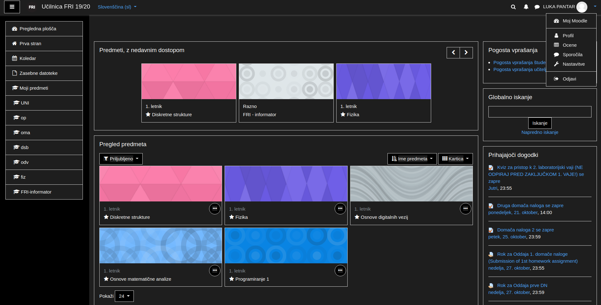
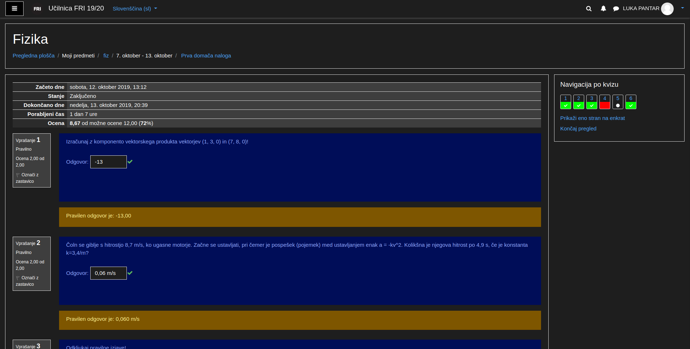

# Dark theme za Spletno učilnico FRI
Dark theme for website https://ucilnica.fri.uni-lj.si with Stylus.

## Preview

## Installation

The browser extension Stylus is required: 

- [Firefox](https://addons.mozilla.org/en-US/firefox/addon/styl-us/)
- [Chrome and other Chromium-based browsers](https://chrome.google.com/webstore/detail/stylus/clngdbkpkpeebahjckkjfobafhncgmne)
- [Opera](https://addons.opera.com/en-gb/extensions/details/stylus/). 

Then:

[Install the usercss](https://github.com/PinkHatHacker/Dark-theme-za-Spletno-ucilnico-FRI/raw/spletna_ucilnica_FRI_dark_theme.user.css) with Stylus.
